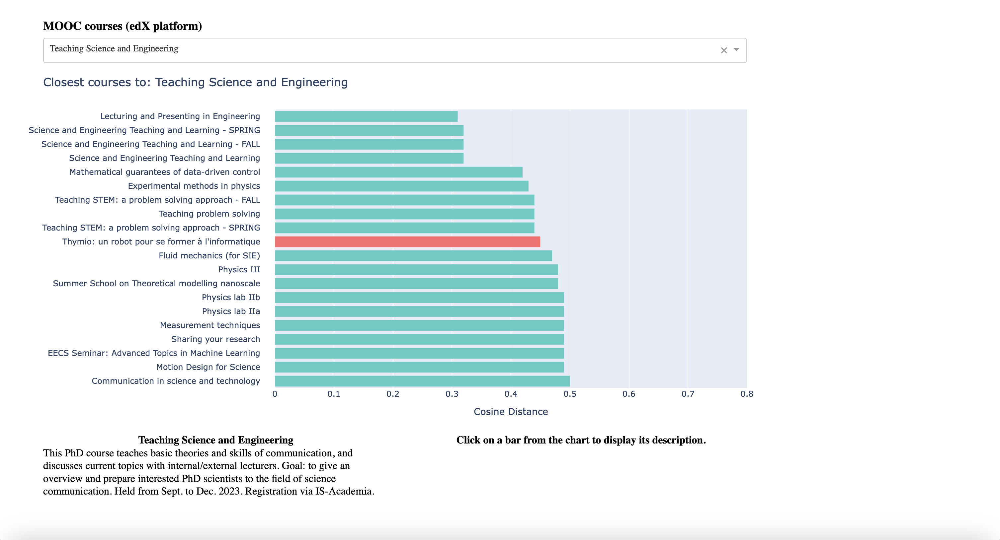

# mooc-embeddings-sim-other-courses
An interactive data visualization from the embeddings from MOOC courses compared to other courses from EPFL.

When the user selects a MOOC course from a list, the top 20 semantically most similar non-MOOC courses available on our online platforms, based on the embeddings of their description, are shown in an interactive bar plot. The user can then select one of these top most similar courses, which will display additional information and both course descriptions side by side.
